# IF3210-2023-Android-NKR

## Deskripsi Aplikasi
NKR-Majika adalah sebuah aplikasi berbasis Android yang dapat digunakan untuk memesan makanan / minuman dari berbagai macam pilihan produk. 
Aplikasi ini juga dapat digunakan untuk mencari lokasi sebuah restoran dan menunjukkan lokasinya menggunakan Google Maps. 
Aplikasi ini juga menyediakan fitur twibbon yang dapat mengambil foto selfie dan menampilkannya serta menyimpan ke dalam internal storage.
Terakhir, aplikasi ini menyediakan metode pembayaran menggunakan QR Code (terdapat QR Code scanner) yang dapat menunjukkan status pembayaran (sukses / gagal).

## Library yang digunakan
1. Moshi retrofit
2. com.github.yuriy-budiyev:code-scanner:2.3.2
3. Sliding pane layout
4. Camera2 API
5. Room
6. Concat Adapter

## Screenshot Aplikasi

### Branch Page
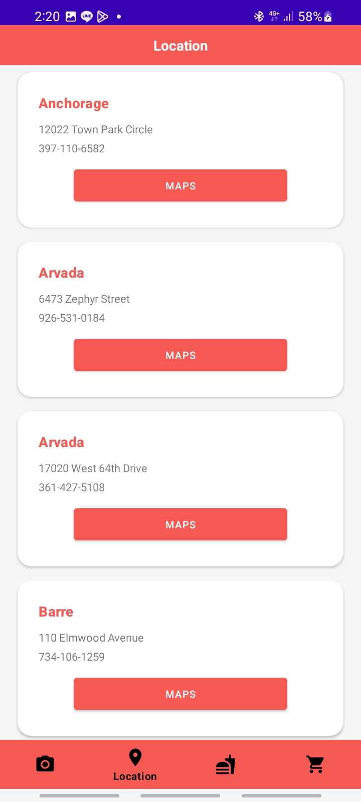

### Cart Page

### Filter Menu
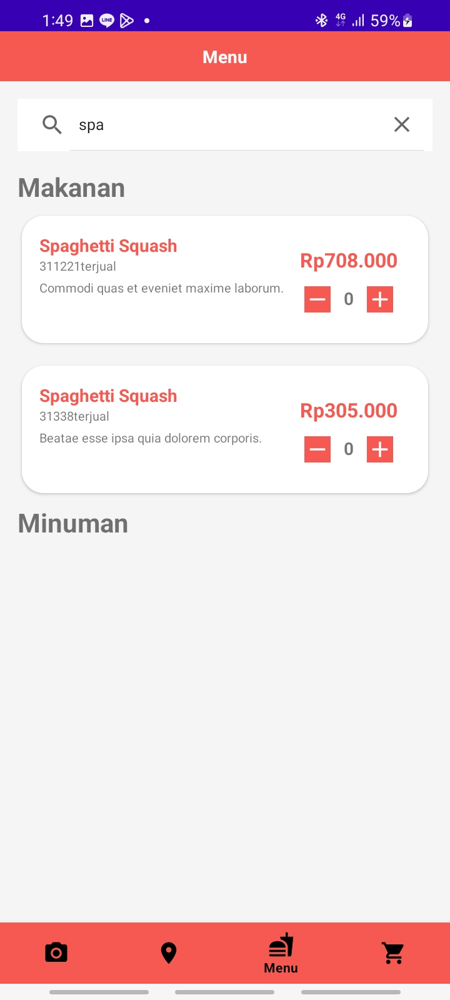

### Maps Activity
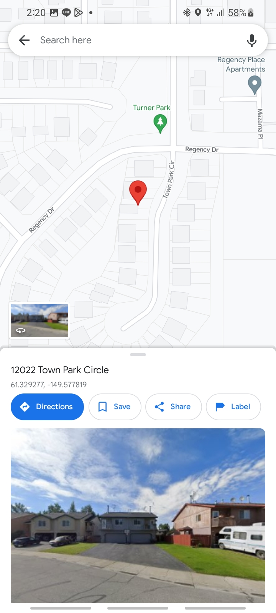

### Menu Page Landscape
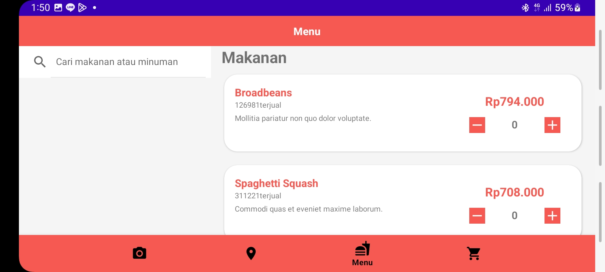

### Menu Page Makanan
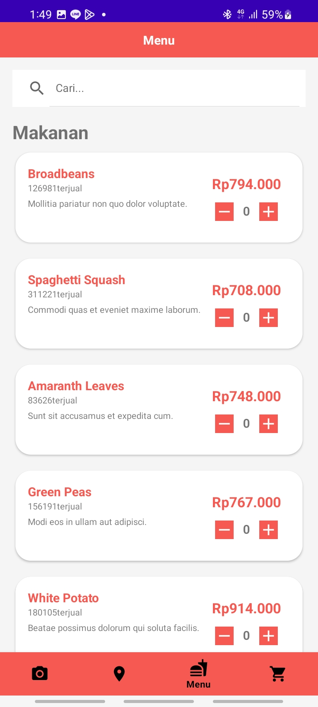

### Menu Page Minuman
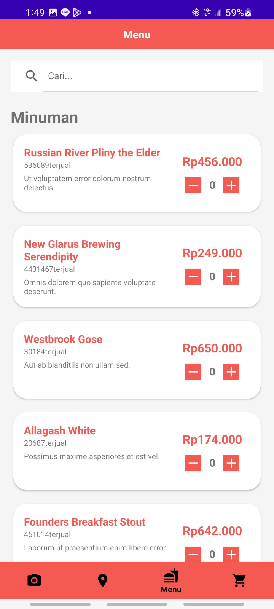

### Payment Failed
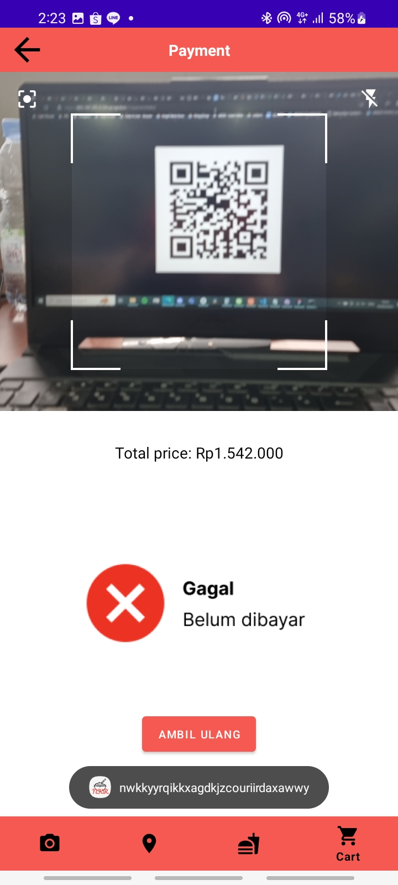

### Payment Succeed
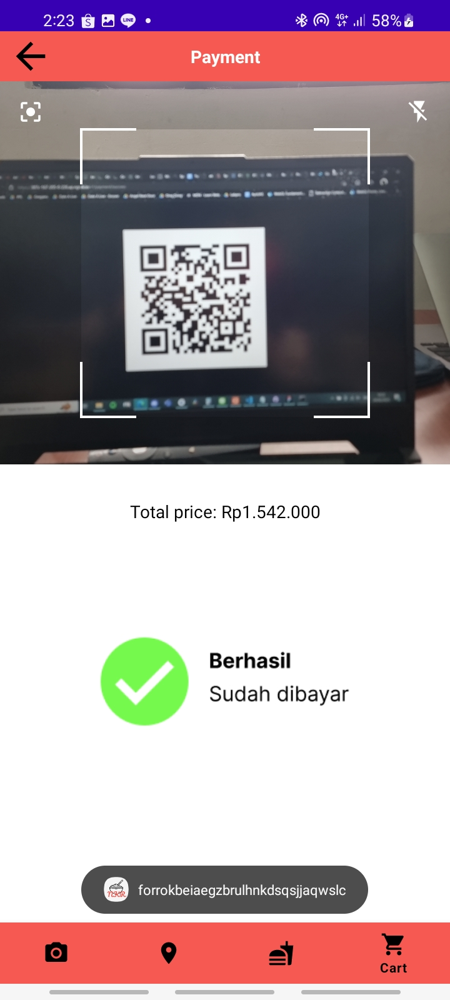

### Request Camera Access
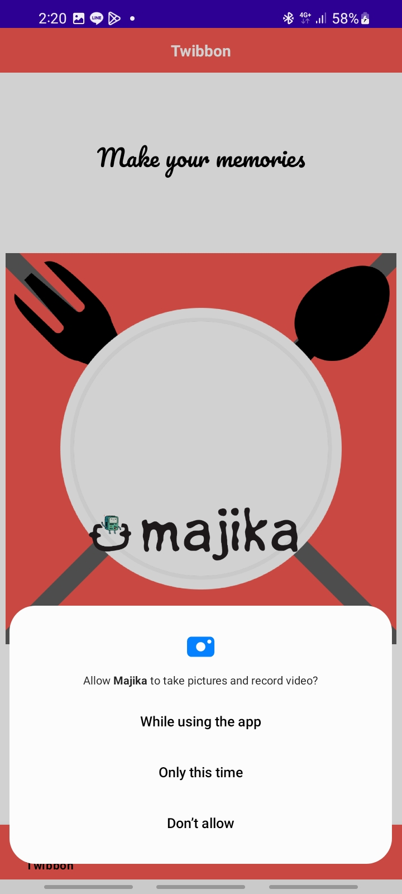

### Splash Screen

### Twibbon Page
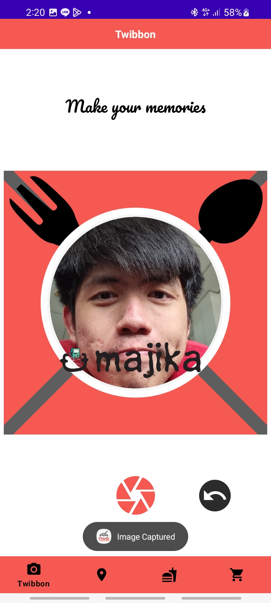

### Temperature Header
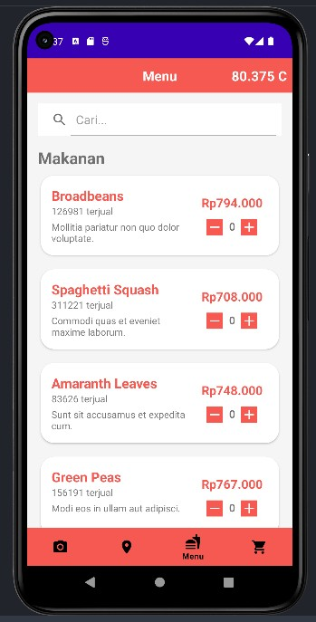

## Pembagian Tugas dan Jam Kerja
<table>
    <tr>
      <td><b>Nama</b></td>
      <td><b>NIM</b></td>
      <td><b>Jam Kerja</b></td>
      <td><b>Pembagian Kerja</b></td>
    </tr>
    <tr>
      <td><b>Muhammad Fikri Ranjabi</b></a></td>
      <td><b>13520002</b></td>
      <td><b>72 Jam</b></td>
      <td><b>Daftar makanan minuman dan halaman pembayaran (scan QR)</b></td>
    </tr>
    <tr>
      <td><b>Rava Naufal Attar</b></a></td>
      <td><b>13520077</b></td>
      <td><b>72 Jam</b></td>
      <td><b>Halaman keranjang dan halaman cabang restoran (google maps)</b></td>
    </tr>
    <tr>
      <td><b>Yakobus Iryanto Prasethio</b></a></td>
      <td><b>13520104</b></td>
      <td><b>72 Jam</b></td>
      <td><b>Header, navbar, dan halaman twibbon (kamera)</b></td>
    </tr>
</table>
